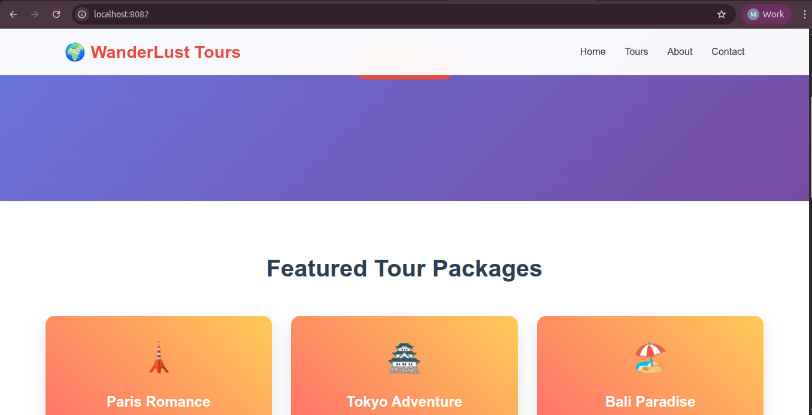

# WanderLust Tours

A modern travel and tour booking website built with PHP, featuring a responsive design and dynamic content management.

## Features

- 🌍 Dynamic tour packages with detailed information
- 📱 Responsive design for all devices
- 📧 Contact form with server-side processing
- 🎫 Tour booking system
- 🏢 Company information and statistics
- 🎨 Modern UI with smooth animations

## Tech Stack

- **Backend**: PHP 8.1+
- **Database**: MySQL 8.0
- **Frontend**: HTML5, CSS3, JavaScript
- **Containerization**: Docker & Docker Compose

## Quick Start

1. **Clone the repository**
   ```bash
   git clone <your-repo-url>
   cd php_docker_mysql_personal
   ```

2. **Set up environment**
   ```bash
   cp .env.example .env
   # Edit .env with your configuration
   ```

3. **Start with Docker**
   ```bash
   docker-compose up -d
   ```

4. **Access the application**
   - Website: http://localhost:8082
   - phpMyAdmin: http://localhost:8081

## Project Structure

```
src/
├── assets/
│   ├── css/style.css      # Main stylesheet
│   └── js/main.js         # JavaScript functionality
├── includes/
│   ├── header.php         # Common header
│   └── footer.php         # Common footer
├── index.php              # Homepage
├── tours.php              # Tours catalog
├── about.php              # About page
├── contact.php            # Contact form
└── booking.php            # Booking system
```

## Development

- PHP files are in the `src/` directory
- CSS and JS assets are in `src/assets/`
- Environment variables are configured in `.env`

## Application



## License

This project is open source and available under the MIT License.
